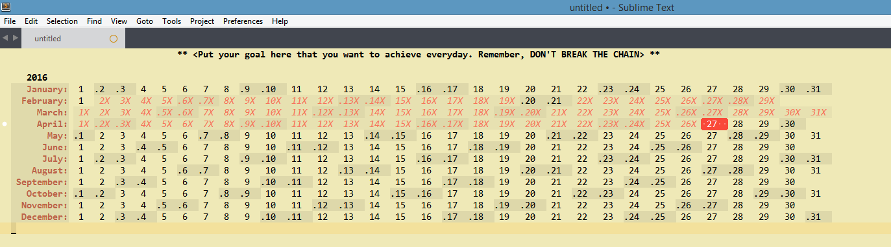

# Sublime in Chains
A Sublime Text calendar plugin to complete and mark your special goal everyday. Inspired by Jerry Seinfeld's "Don't break the chain" productivity method.

## Features

* You can have as many calendars as you like saved in individual `.chains` file extension
* You can highlight multiple dates and toggle them
* Weekends are clearly marked
* Current date is automatically highlighted in red, becomes green when toggled done
* Quick key binding to mark `today` done
* Forbid toggling on future dates

And remember __"Don't Break The Chain!"__

## Installation

### Using Package Control:

* Bring up the Command Palette (Command+Shift+P on OS X, Control+Shift+P on Linux/Windows).
* Select Package Control: Install Package.
* Select Package Sublime In Chains to install.

### Not using Package Control:

* Save files to the `Packages/Package Syncing` directory, then relaunch Sublime:
  * Linux: `~/.config/sublime-text-2|3/Packages/SublimeInChains`
  * Mac: `~/Library/Application Support/Sublime Text 2|3/Packages/SublimeInChains`
  * Windows: `%APPDATA%/Sublime Text 2|3/Packages/SublimeInChains`
  * 
  
## Usage
* Create a new file - `ctrl or cmd + shift + p`. Select `Chains: New Document`
* `ctrl or cmd + d` to `mark_as_done`
* `ctrl or cmd + e` to `unmark_done`
* `ctrl or cmd + x` to `done_toggle`
* `ctrl or cmd + shift + d` to `mark_today_as_done`
